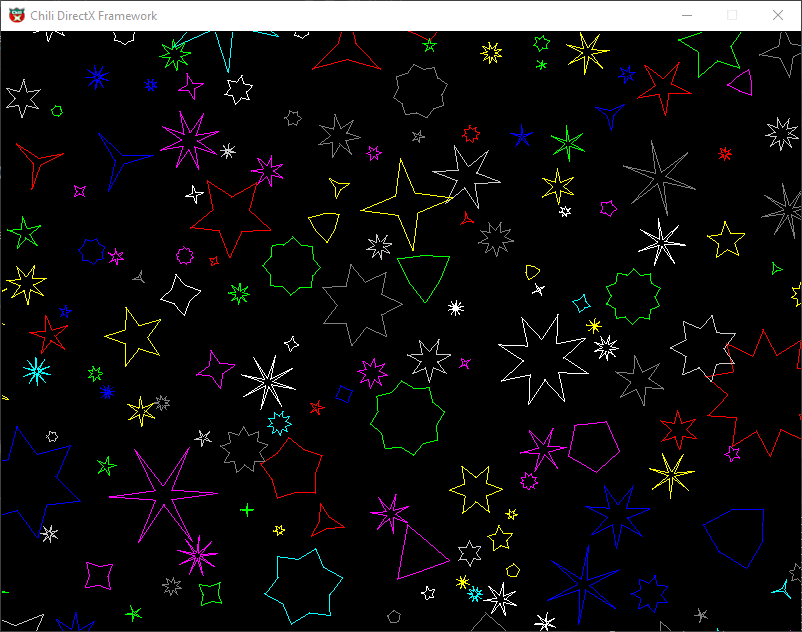

# 3D_CG_adv
Following Chili's advanced game programming tutorials
In an existing DirectX Framework, we build a 2D vertex model rendering pipeline with mouse control and all transformations applied trough matrix manipulation with a custom Mat3 class

